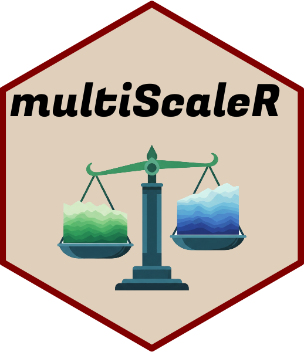

<!-- README.md is generated from README.Rmd. Please edit that file -->

# multiScaleR 

## Overview

multiScaleR is an R package to identify the scale of effect of spatial
environmental variables in regression analyses.

Functions to simulate data with known scales of effect are included with
this package.

## Installation

If installing the development version from GitHub, Windows users will
need to install RTools first. Rtools provides a compiler and some
helpers to compile code for R in Windows. Download Rtools from here:
<https://cran.r-project.org/bin/windows/Rtools/> and select the
appropriate Rtools version (4.0 with R 4.x.x)

To install, right click on the “.exe” file and select “Run as
administrator”.

Then execute the following commands in R:

``` r
# Install 'remotes' package, if needed
if(!("remotes" %in% list.files(.libPaths()))) {
      install.packages("remotes", repo = "http://cran.rstudio.com", dep = TRUE) 
} 

remotes::install_github("wpeterman/multiScaleR", 
                        build_vignettes = TRUE) # Install & build vignette

library(multiScaleR) # Loads package and the other dependencies
```

The package vignette walks through all available functions as well
provides worked analyses of simulated data.

<p align="center">


</p>
